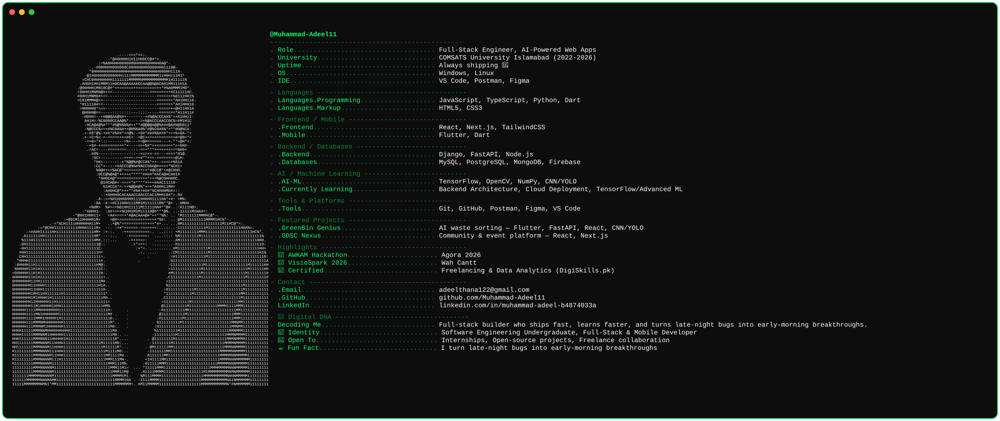

  

<h1 align="center">Hi 👋, I'm Muhammad Adeel</h1>

<h3 align="center"> Passionate about Full-Stack Development 💻, AI-Powered Web Apps 🤖, Mobile Development 📱, and Cloud Deployment ☁️ </h3>

  

🚀 About Me

* 🔭 Currently working on **GreenBin Genius**, an AI-powered smart waste sorting web & mobile app, and **GDSC Nexus**, a community & event management platform, with a focus on **Full-Stack Architecture, AI Integration, Image Classification, Backend Architecture, and Cloud Deployment.**

* 🌱 Currently learning **Backend Architecture patterns, Cloud Deployment workflows, and TensorFlow / advanced AI-ML applications.**

* 👨‍💻 Projects:
  👉 [My GitHub](https://github.com/Muhammad-Adeel11)

* 💬 Ask me about **React/Next.js, Flutter, Django/FastAPI, and AI integration**

* 📫 Email: **[adeelthana122@gmail.com](mailto:adeelthana122@gmail.com)**

 

---

# 🌐 Connect With Me

---

# 💻 Programming Languages

---

# 🤖 Machine Learning & AI

### 🔬 Specialization
- CNN / YOLO
- Computer Vision
- Image Classification
- AI Integration

---

# 🌐 Web Development

---

# 💾 Databases

---

# 📱 Mobile Development

---

# 🛠️ Tools & Development

---

# 🎨 Design & Documentation

---

# 🟡 Github Contribution Graph

<picture>
  <source media="(prefers-color-scheme: dark)" srcset="https://raw.githubusercontent.com/Muhammad-Adeel11/Muhammad-Adeel11/output/pacman-contribution-graph-dark.svg">
  <source media="(prefers-color-scheme: light)" srcset="https://raw.githubusercontent.com/Muhammad-Adeel11/Muhammad-Adeel11/output/pacman-contribution-graph.svg">
  
</picture>

---

&nbsp;

